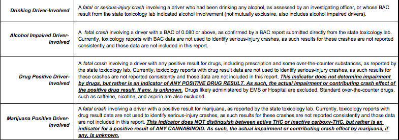
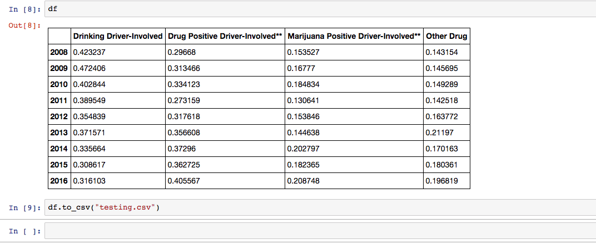

# Legalizing Marijuana Haven't Caused More Drug Related Fatal Crashes 

[**Tableau Public Link** ](https://public.tableau.com/profile/yuhao.wang#!/vizhome/Final_Version/Sheet1?publish=yes)  
[**Jupyter Notebook Link**](https://github.com/HowellWang/Data_Viz_HW/blob/master/Deceptive/Deceptive_Visualization.ipynb)

This README file contains the following project delieverables

1. [Project statement](#1)
2. [Data Wrangling](#2)
3. [Intermediate visualization prototypes](#3)
4. [Final data visualization](#4)
5. [Argument Model](#5)
6. [Showcase video](#6)

 
<b>Just for fun: What is the deceptive visualization!</b>

## Project Statment 

### Motivation:

Marijuana is always a sensitive and controversial issue in the world and USA. As the first state that legalize the medical marijuana, Washington State's experiment must leave us large amounts of cases to study. So when I set about my deceptive visualization project, the social situations after legalizing marijuana becomes my first choice.

### Objective:
This is the [original data](http://wtsc.wa.gov/download/2388/Washington2008-2015.xls) for the [article](http://www.mcoscillator.com/learning_center/weekly_chart/higher_drug_related_fatal_crashes_after_marijuana_legalization/) I choose to deceptive. In that article, the author make such an argument that:

 * Higher Drug Related Fatal Crashes After Marijuana Legalization.

When I saw the author used the raw number to support his argument, I instantly had doubts on it. We are easy to fall into the number trap when we ignore the changes of proportion.  

So the objective of my deceptive will be presenting the change of the marijuana proportion of all drugs over year. 

### Project Plan:
1. Use the original data to get the growth of per year, the changes of marijuana proportion of total and the changes of marijuana proportion of all drugs.
1. Throw those to tableau or visualize it directly by matplotlib, and find which charts can help me deceptive the original visualization.
1. Finish the data wrangling in Jupyter Notebook and save the final version.
1. Upload the deceptive data to the tableau and beautify it.
1. Accomplish the data visualization.

## Data Wrangling
Before we look at the data, we need to know what the data represented. That's the data read-me file from the original data files. 

There are some overlap data that we will be confused with it. The article's author's interpretation conforms with mine. So I decide use this interpretation for my following deceptive job. 

Read the original data and glance it. 
 
Extract the data that we would use, rename the column names and transpose the row to column. 
 
First try: check the growth of the marijuana proportion of total crashes over year.
 
Second try: only consider the marijuana proportion of total crashes per year.
 
Final try: only consider the marijuana proportion of all drugs, yes, it can deceptive the original visualization. 

## Intermediate visualization prototypes
Based on 3 different tries in data wrangling step, my visualization also have 3 different edition. 
In my first edition, I visualized the growth of the marijuana proportion of total crashes over year, unfortunately, the visualization result is still similar to the original argument. So I have to give up this idea and turn to find other variables. 

The second visualization try still disappointed me. Although I can use it to make some arguments, it still explained very grudgingly. 

## Final data visualization

In my final try, I got the thing I wanted. It is interesting, the situation in 2013 is better than 2011. Although the proportion has increased in a few years later, however, the proportion of marijuana in fatal crashes caused by drugs is no higher than it was a few years before legalization! So I can say that: Legalizing Marijuana Haven't Caused More Drug Related Fatal Crashes! 

## Argument Model
Claims:
<li>Legalizing Marijuana Haven't Caused More Drug Related Fatal Crashes!</li>
Qualifier:
<li>Causes of fatal crashes over year</li>
Data:
<li>The proportion of marijuana in fatal crashes caused by drugs from 2008 to 2016.</li>
Warrant:
<li>Compared the value of proportion before and after 2012 (WA legalized recreational pot use in this year)</li>

## Showcase video
 
 

