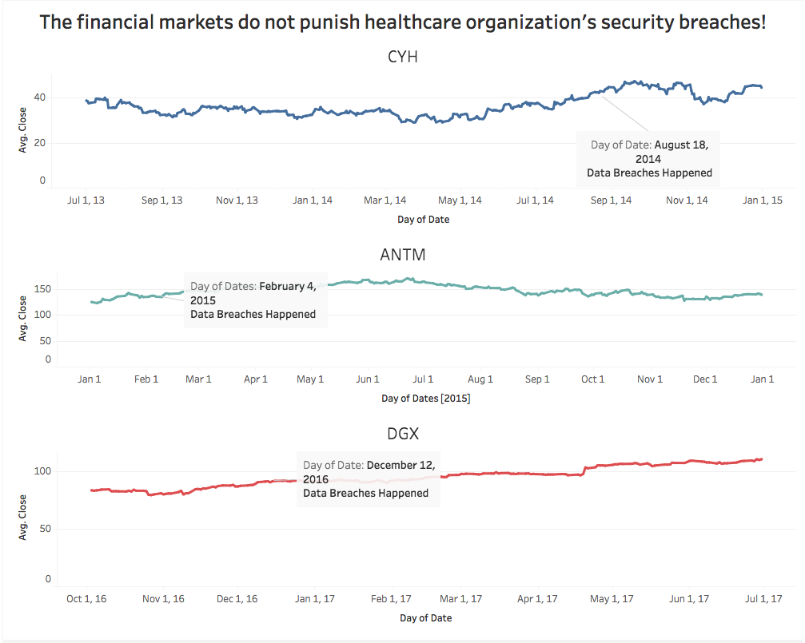
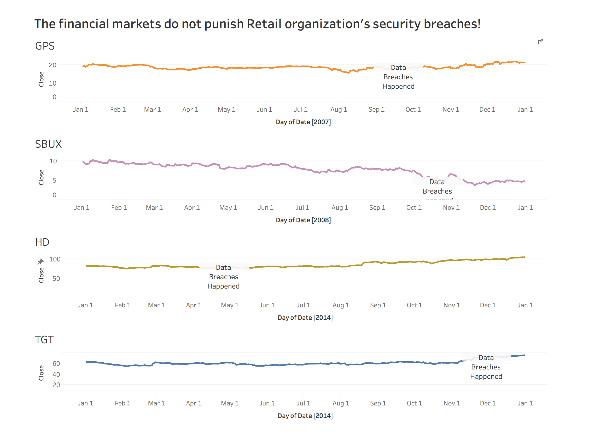

# Lab7
### Visualization Redesign 
[Tableau Public Link: HealthCare](https://public.tableau.com/profile/yuhao.wang#!/vizhome/Lab7_41/HealthCare)
[Tableau Public Link: Retail](https://public.tableau.com/profile/yuhao.wang#!/vizhome/Lab7_41/Tail?publish=yes)
### Claim

<b>1.The financial markets do not punish healthcare organization's security breaches!</b> 
<b>2.The financial markets do not punish retail organization's security breaches!</b>

### Critique on visualization of Lab 3

1. I choosed two companies from different industries, which could not be representativeness.
 
1. I didn't concentrate my visualization on one industry.

### Road map for improvement

1. I choose to give up Equifax as my visualization object company.

1. Recollected healthcare and retail companies' stock data.

1. Compared the different healthcare and retail companies' stock changes when the data breaches happened.

### How have I improved the visualization

1. Summarize done claim that can let my visualization be a universal guide for healthcare industry

1. Put annotation to indicate where the security breaches happened

1. Built a dashboard to present all the outcomes which can spare audience's time 

