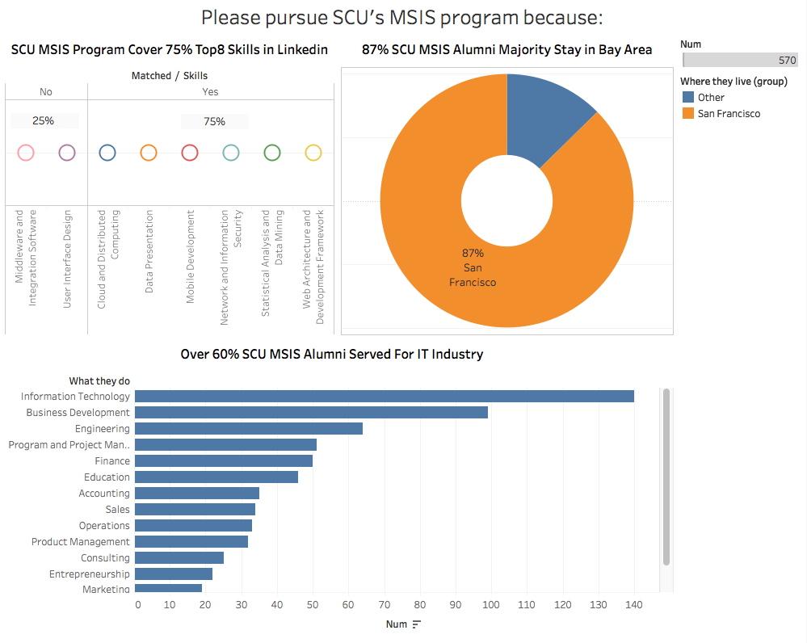

# MSIS Program Fact Sheet

### Motivation:

When we decide whether we will choose one program for further study, we would have many factors and measures to make decision, like
<li>Skills can be obtained</li>
<li>Geographical location</li>
<li>Ratio of jobs in our fileds</li>

So our dashboard must let our audiences know whether our program caters for their purpose from first glance. 
And our dashboard should be presenting the things that are considered by those audiences.

### Critique on visualization of Lab 5

1. Bar charts could not represent the ratio between skills from SCU and top8 Linkedin skills.
2. Previous claims were not cutting on the fact sheet very well.
3. Only presented SCU's situation, comparison could let the visualization more persuasive.

### Road map for improvement

1. Reconsider the relationship between charts and claims. I find that bar charts must be a disaster for presenting the subset relationship, and bubble chart also cannot present info effective. 
2. Use the data from other students to compare SFSU's graduate information system program.
3. Try to combine two metrics together.

### How have I improved the visualization

1. Refresh claims to the fact sheet rather than present metrics directly. So audience can make a judgement after looking my visualization.

1. Polish the visualization and throw away the useless bar charts and bubble charts

1. Combing two metrics together and letting it more intuitive.

### Visualization Redesign 

### Further Way

If I have more time, my documention could be more ample.

