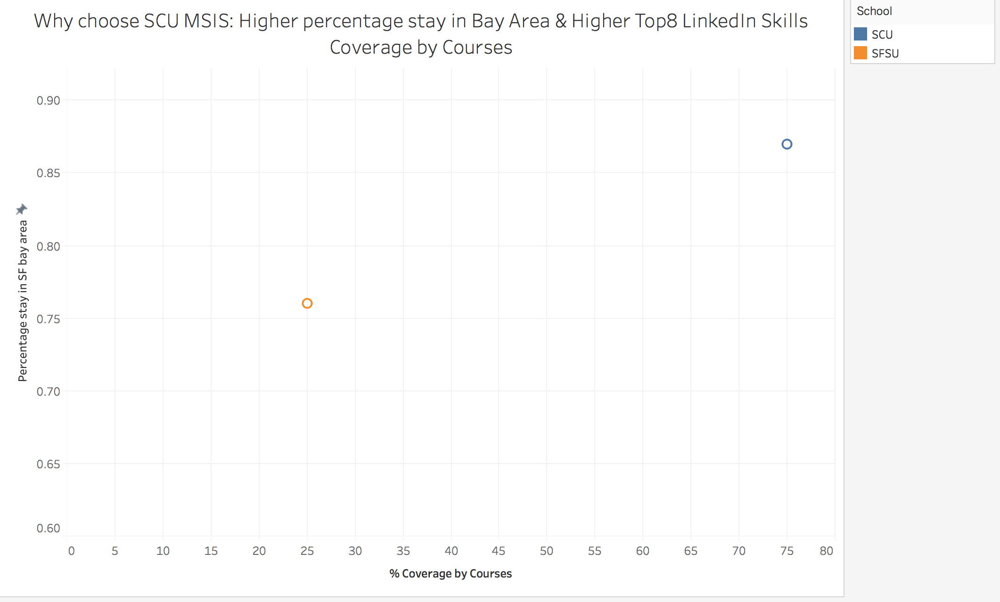

# Lab8

### Motivation:

When we decide whether we will choose one program for further study, we would have many factors and measures to make decision, like
<li>Skills can be obtained</li>
<li>Geographical location</li>
<li>Ratio of jobs in our fileds</li>

So our dashboard must let our audiences know whether our program caters for their purpose from first glance. 
And our dashboard should be presenting the things that are considered by those audiences.

### Critique on visualization of Lab 5
 
1. I didn't add claims to the fact sheet.
2. Bar charts could not represent the ratio between skills from SCU and top8 Linkedin skills

### Road map for improvement

Reconsider the relationship between charts and claims. I find that bar charts must be a disaster for presenting the subset relationship, and bubble chart also cannot present info effective.
So I decide to use side-by-side cycles to help me visualize the subset info.

### How have I improved the visualization

1. Add claims to the fact sheet rather than present metrics directly

1. Polish the visualization and throw away the useless bar charts and bubble charts

### Visualization Redesign 

