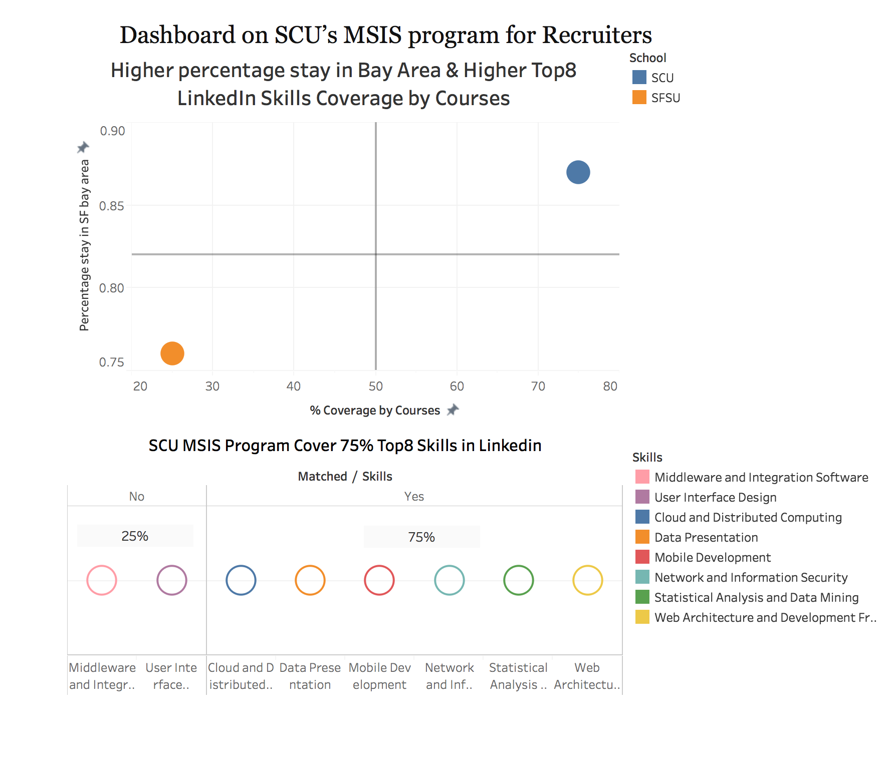

# Dashboard on SCU’s MSIS program for Recruiters

### Motivation:

When I design the dashboard, I pretend to be a technical recruiter who works in San Francisco Bay Area and wants to recruite a person with hotter job skills. Based on those situations, I would develop such factors and measures on below to distinguish whether the one can be my ideal candidate:
<li>Skills they grasped</li>
<li>their Geographical location</li>
<li>historical alumni data</li>

Besides that, I also should consider how I can let SCU MSIS' students be more attractive. As we know, there is not only one great university in SF Bay Area, so integrating serveal metrics together becomes very important when I design the dashboard.

### Critique on visualization of Lab 6

1. Bubble charts are beautiful but useless when I want to prove the higher ratio, because we need some comparsions when we cannot say our program can include any skills in the top8 LinkedIn skills' list.
2. Although the last dashboard (Lab6) is designed for recruiters, its target audience is still not very clear. I will focus on the recruiter on my this work.
3. Only presented SCU's situation, comparison could let the visualization more persuasive. 
4. The metrics cannot be integreated very well. 

### Road map for improvement

1. Use the data from other students to compare SFSU's graduate information system program. Comparison can help recruiters make a quick decision when they watch the dashboard.
2. Try to combine serveral metrics together. 

### How have I improved the visualization

1. Refresh claims to the fact sheet rather than present metrics directly. So recruiters can make a judgement after looking my visualization.

1. Polish the visualization and throw away the useless bubble charts

1. Combing several metrics together and letting it more intuitive. I will use the alumni location data to present their geolocation information and historical success. If there are lots of alumni who stay in SF Bay Area after graduating, we can say that SCU MSIS's students are so excellent that they can get a local job and stay here. So the recruiter will be glad to recruite SCU MSIS's alumni. Besides the location strength compared to students who pursures degree in other area, the SCU MSIS's students do very well so that they can get the job in SF Bay Area. 

### Visualization Redesign 

