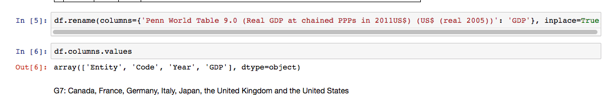

# On Suicide (Der Selbstmord)

[**Tableau Public Link** ](https://public.tableau.com/profile/yuhao.wang#!/vizhome/OnSuicide/Japan?publish=yes)  
[**Jupyter Notebook Link**](https://github.com/meiyuanli312/Dashboard/blob/master/Redesign/Redesign%20-%20Meiyuan%20Li.ipynb)

This README file contains the following project delieverables

1. [Project statement](#1)
2. [Data Wrangling](#2)
3. [Intermediate visualization prototypes](#3)
4. [Road Map](#4)
5. [Final data visualization](#5)
6. [Road map with future features](#6)
7. [Showcase video](#7)

## Project Statment 
<b>Motativation:</b> Prior to my decision to turn to software engineer, I was interested in social theory for several years and was preparing for applying Social Theory and Political Philosophy's Phd for a long term. As [Émile Durkheim](https://en.wikipedia.org/wiki/%C3%89mile_Durkheim)'s big fan, I know a lot about his masterpiece '<b>On Suicide</b>'. Although I don't have much time to review these works now, these works still hide in my heart. When I was stuck in looking for some charts for my visualization redesign project, one topic leaped to my eyes. I took a good look at the charts about suicide analysis, however, I always felt that something was missing. At the same time, I recalled the arguments in On Suicide, so I decided to find more resoures to polish the original charts. Besides that, I also want to use this job to pay tribute to my past.

<I><b>Suicide:</b></I> In Durkheim's view, suicide comes in four kinds: <I>Egoistic suicide</I>, <I>Altruistic suicide</I>, <I>Anomic suicide</I>, <I>Fatalistic suicide</I>. On my redesign project, I will choose Anomic sucide as my entry point. Anomic suicide reflects an individual's moral confusion and lack of social direction, which is related to dramatic social and economic upheaval. This is symptomatic of a failure of economic development and division of labour to produce Durkheim's organic solidarity. People do not know where they fit in within their societies. 

### Visualization Critique: 
This is [original visualization](https://ourworldindata.org/suicide/) I choose to redesign. Admittedly, that visualization report is a pretty good one, the author try to present the countries with higher suicide rate and find the correlated variables to explian why people choose to suicide. However, that report does have a few obvious deficiencies. I'll point out some shortages of the report, and give some advices to improve it on following parts.

 * The countries data that the author wants to present is not even. As we can see, there are a list of countries: Russia, Japan, Sweden, United States, Nigeria, United Kingdom and Brazil, the years of those countries he chooses are different, several countries' year variable are fewer than others. So we can see that situation will affect audience's judgement and mislead the trends of suicide.  
 
 * The factors that affect if people would turn to suicide have different defects. The author tries to present the influences from economic crisis, but he/she doesn't give a trend of economic while there is a vertical broken line on 1997. I think the his/her job doesn't finish, and only one year's situation cannot prove anything. So I will compare the GDP growth rate with the suicide rate in my redesign work. 
  
 * As to the other factors that the author thinks those would influence suicide, I think those may not be accurate or persuasive. For instance, he/she thinks the mass media would cause the suicide behavior. I think the author doesn't get the enough proofs to advocate his/her assumption when he/she gives the relevant study. Because several centuries' sociology and communication study has already proved that medium is not the direct inducement of suicide. Suicide is a social (real world) and sociological (academic) problem, social structure is the real reason that influences the suicide. And his/her claim may a little dangenours in a way that defending the media censorship. So I will skip such factors when I work for the redesign project.
 
 
 
### Data I used:
[link1](https://goo.gl/pULF4m) 
[link2]( https://data.bls.gov/timeseries/LNS14000000) 
[link3](https://ycharts.com/indicators/uk_unemployment_rate)

### Project Plan

1. Visualize the raw data and get the basic project visualized viw.
1. Find out whether I need to more data to advocate my claim
1. Purified data by Jupyter Notebook
1. Load the purified data into Tableau and tune the charts
1. Completed the whole visualization

## Data Wrangling
Check the data first
 
Rename column to let it be more readable
 
Slice G7's data from the datasets
 
Save the sliced data
 
Wrangle the US and UK's unemployment data
 
 

##  Intermediate Visualization Prototypes

### 1. Intermediate visualization for the first try (Before I used G7's data on my project)
That's my first try before I start data cleaning, I found the data of Russia and Japan is not even because of the destruction of C.C.C.P. Besides that, the gross GDP can mislead us a lot, so I choosed to use the five years GDP growth rate to replace it.
 
 
### 2. Intermediate visualization for the second try (I had the G7's data)
That's my second try after I finished the data cleaning. However, there still was the historical factor (West Germany and East Germany), so I decide to not consider the Germany's situation. 
 
### 3. Intermediate visualization for the third try
Especially, US's suicide rate is a little stable, so I decide to increase more one variable to analyze US's suicide.
 
 

## Road Map: 

It is easy to critique and deconstruct a topic, but it is not my purpose. Collecting data and cleaning data in this project would not be hard, making impressive critics and identifying my audiences would be more important and hard.
According to critiques I mentioned, I decide to gather the the past 50 years' (1955 - 2005) data of suicide rate and GDP growth rate of G7, which are the most rich countries in this world and their experience a stable social environment after War II (except Germany, there were ever two Germany before 1990s), and draw the trend line chart to analyze the correlation between suicide and economic growth. Thanks to Durkheim's study, the correlation is significant. When the economic development is good, the suicide rate is getting low, and vice versa. Although UK and US's suicide rate don't change a lot as the growth rate change, we can still see the changes in those countries. As the old developed countries, their societies are more stable and economically sound, so the changes of economy cannot affect the suicide rate a lot. I try to use unemployment to help me find more clues, but it doesn't work well.

There is Japan's chart, we can easily see that the suicide would get the bottom when the GDP growth goes to the peak, and vice versa. 

##  Final Data Visualization
<b>Claim:</b> When the economic development is good, the suicide rate is getting low, and vice versa
 
 
 
 
 
 
 
## Road map with future features
If I have more time on this project, I would dive into some emerging countries like BRICS. It would present us the relations among suicide, society variation and economic growth. It must be a very interesting topic.

